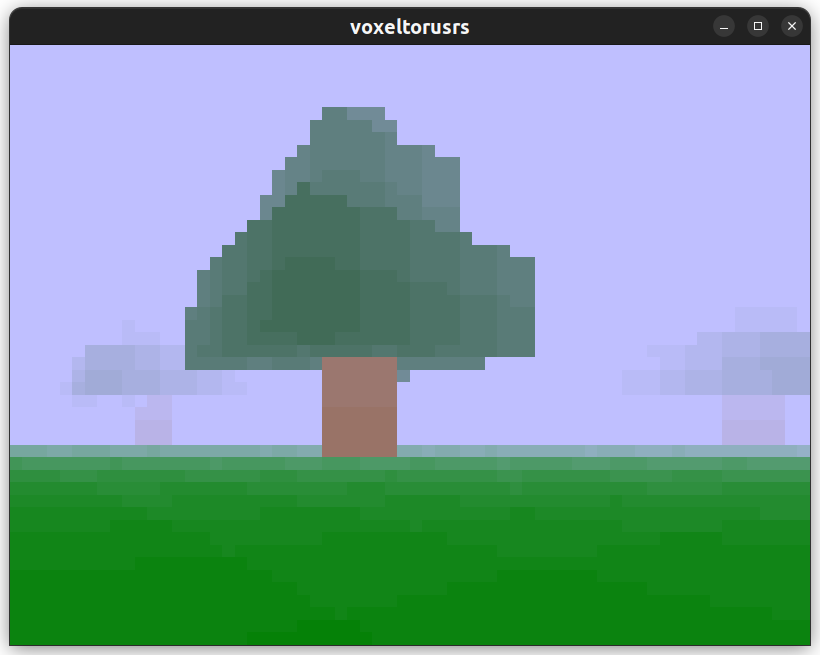

# voxeltorusrs

It is a raycasting voxel engine written in Rust... I hope you like it..

To use it, clone the repository with git, then build and run:

```sh
git clone https://github.com/vilimus/voxeltorusrs.git
cd voxeltorusrs
cargo build
cargo run
```


